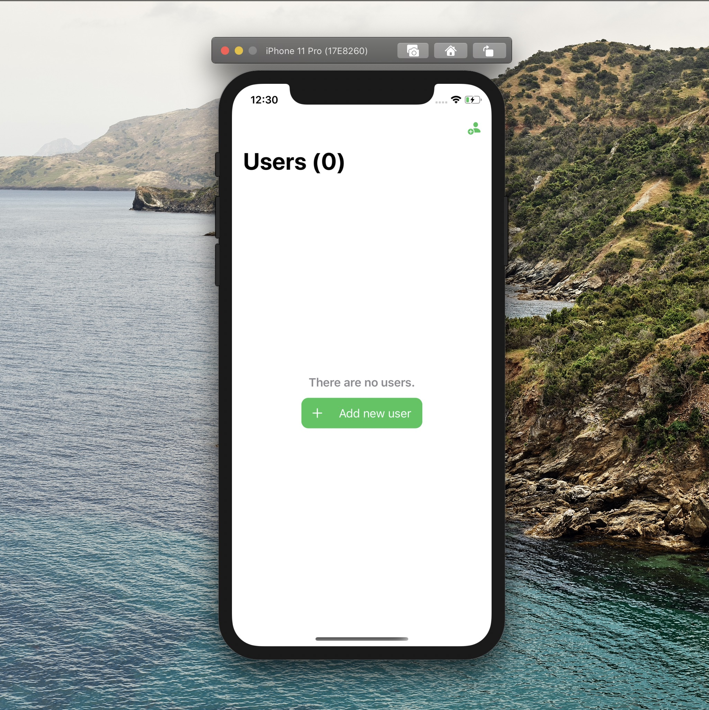

# swiftUI-graphql

_Feel free to download it and test it!_ 🎉

This a simple SwiftUI App connected to a simple graphql server, it is made it for learning swiftUI and show how can they work toggeter.

### Graphql Playground

https://swiftui-graphql-nexus.herokuapp.com/

### Apollo Documentation:

https://www.apollographql.com/docs/ios/

### Nexus Documentation using Prisma plugin

https://www.nexusjs.org/#/plugins/prisma
